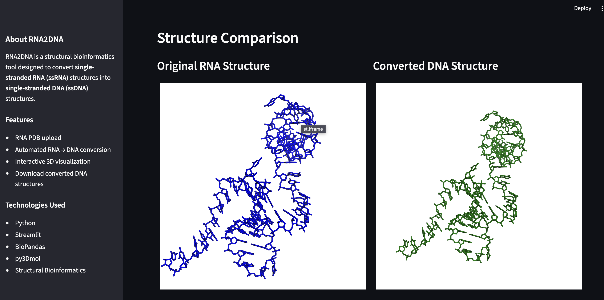

# 🧬 RNA2DNA Dashboard
```markdown


```


An interactive **Streamlit-based structural bioinformatics application** for converting **single-stranded RNA (ssRNA)** three-dimensional structures into **single-stranded DNA (ssDNA)** structures with integrated **3D visualization**.

RNA2DNA combines nucleic acid structure conversion workflows with modern scientific software design, enabling researchers to upload RNA structures, perform automated RNA-to-DNA conversion, visualize structures interactively, and download converted DNA models.

---

## ✨ Features

* Upload **ssRNA structures** in PDB format
* Automated **RNA → DNA conversion**
* Interactive **3D visualization** of RNA and DNA structures
* Side-by-side structural comparison
* Download converted **DNA.pdb** files
* Example RNA structure provided for testing
* User-friendly Streamlit interface

---

## Dashboard Preview

### RNA2DNA Dashboard


### RNA vs DNA Structure Comparison



---

## Workflow

```text
Upload RNA PDB
        ↓
RNA Structure Validation
        ↓
RNA → DNA Conversion
        ↓
DNA Structure Generation
        ↓
Interactive 3D Visualization
        ↓
Download DNA.pdb
```

---

## Repository Structure

```bash
RNA2DNA_Dashboard/
│
├── app.py                    # Streamlit dashboard
├── RNA2DNA.py                # RNA to DNA conversion engine
├── examples/
│   └── example_rna.pdb       # Example input structure
│
├── docs/
│   ├── dashboard_home.png
│   └── dashboard_3dviewer.png
│
├── requirements.txt
├── README.md
├── LICENSE
└── .gitignore
```

---

## Installation

Clone the repository:

```bash
git clone https://github.com/AbhignaNagaraj/RNA2DNA_Dashboard.git

cd RNA2DNA_Dashboard
```

Install dependencies:

```bash
pip install -r requirements.txt
```

---

## Requirements

* Python ≥ 3.10
* Streamlit
* BioPandas
* Pandas
* NumPy
* py3Dmol

Install manually:

```bash
pip install streamlit biopandas pandas numpy py3Dmol
```

---

## Running the Dashboard

Launch the Streamlit application:

```bash
streamlit run app.py
```

The application will open automatically in your browser.

---

## How to Use

1. Upload an RNA structure in **PDB format**
2. Click **Convert RNA → DNA**
3. Visualize the original RNA and converted DNA structures interactively
4. Download the generated **DNA.pdb** file

---

## Applications

* Structural Bioinformatics
* Nucleic Acid Modeling
* Computational Biology Education
* Scientific Software Development
* Biomolecular Structure Analysis
* Bioinformatics Training and Demonstration

---

## Technologies Used

* **Python**
* **Streamlit**
* **BioPandas**
* **py3Dmol**
* **Pandas**
* **NumPy**

---

## Future Enhancements

* Support for batch conversion of multiple structures
* Additional nucleic acid validation checks
* Advanced structural comparison metrics
* Streamlit Cloud deployment
* Exportable conversion reports

---

## Author

**Dr. Abhigna N U**

PhD in Bioinformatics | Computational Biology | Structural Bioinformatics | Scientific Software Development

GitHub: https://github.com/AbhignaNagaraj

LinkedIn: https://www.linkedin.com/in/dr-abhigna-bioinformatics/

---

## License

This project is licensed under the MIT License.
